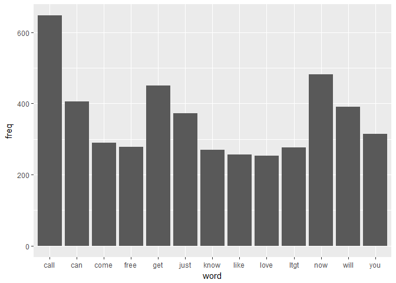
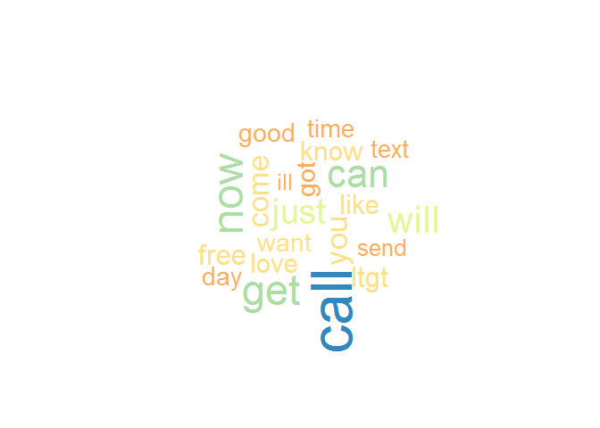
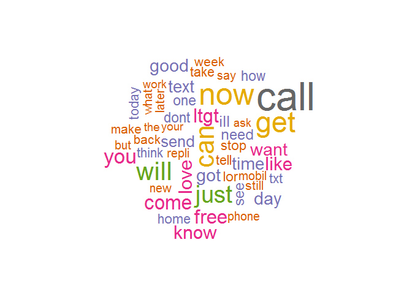
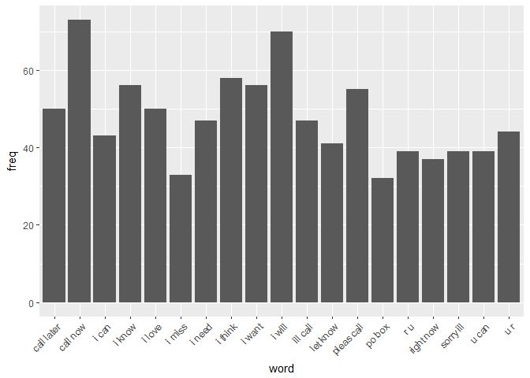
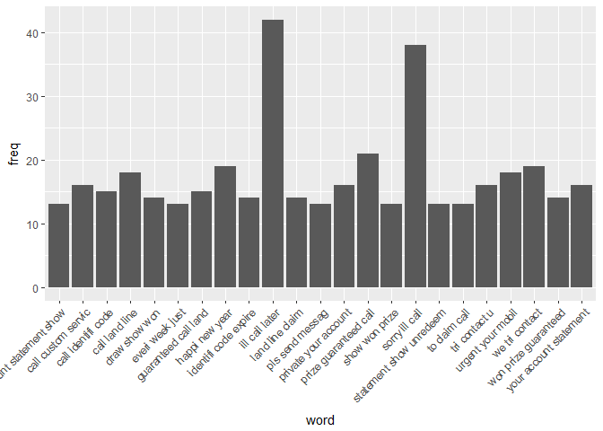
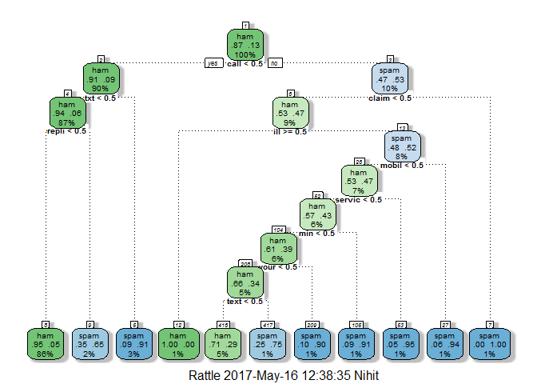
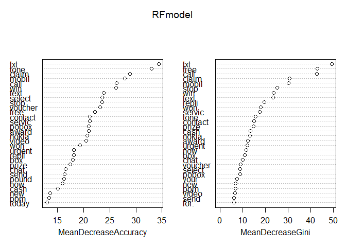

SMS Spam Filter
================
**Author:** Nihit R. Save <br />
**Date:**   9th May 2017 <br />
**Dataset**: https://www.kaggle.com/uciml/sms-spam-collection-dataset


### Dataset information
The SMS Spam Collection is a set of SMS tagged messages that have been collected for SMS Spam research. 
It contains one set of SMS messages in English of 5572 messages, tagged according being ham (legitimate) or spam.


Data Exploration
================

Loading the dataset from work directory.

``` r
spam <- read.csv("spam.csv", stringsAsFactors = FALSE )
View(spam)
```

We notice that columns X, X.1 and X.2 contain parts of text that are too big to be stored in single column of V2 in a csv file. We shall store the entire text in a single V2 column.

``` r
spam$v2 <- paste(spam$v2,spam$X,spam$X.1,spam$X.2)
spam <- spam[,c(1,2)]
names(spam) <- c("type","text")
```

Converting Type column to factor.

``` r
spam$type <- as.factor(spam$type)
levels(spam$type)
```

    ## [1] "ham"  "spam"

We have 2 levels for type, 'ham' for real messages and 'spam' for spam messages.

Creating and Cleaning Corpus
============================

Creating a volatile corpus from vector text of spam data frame.

``` r
library(tm)
```

    ## Loading required package: NLP

``` r
library(SnowballC)
corp <- VCorpus(VectorSource((spam$text)))

corp[[1]]$content
```

    ## [1] "Go until jurong point, crazy.. Available only in bugis n great world la e buffet... Cine there got amore wat...   "

We can see that a corpus was succesfully created and we can check content of any of the 5572 text messages as above.

Lets clean the corpus by removing punctuation,numbers,white spaces and stop words. We will also perform transformations of cleaned corpus like stemming and changing text to lower case.

``` r
corp <- tm_map(corp, removeWords,c(stopwords("english"),"å","‰û"))
corp <- tm_map(corp, stemDocument,language = "english")
corp <- tm_map(corp, content_transformer(tolower))
corp <- tm_map(corp, removePunctuation)
corp <- tm_map(corp, removeNumbers)
corp <- tm_map(corp, stripWhitespace)
```

We can see  the transformed text below.

``` r
corp[[1]]$content
```

    ## [1] "go jurong point crazy availabl bugi n great world la e buffet cine got amor wat"

Exploring Document Term Matrix
==============================

``` r
dtm <- DocumentTermMatrix(corp)
inspect(dtm)
```

    ## <<DocumentTermMatrix (documents: 5572, terms: 7640)>>
    ## Non-/sparse entries: 45566/42524514
    ## Sparsity           : 100%
    ## Maximal term length: 40
    ## Weighting          : term frequency (tf)
    ## Sample             :
    ##       Terms
    ## Docs   call can come free get just ltgt now will you
    ##   1085    0   0    1    0   1    0    0   0   11   0
    ##   1579    0   0    0    0   0    0   18   0    0   0
    ##   1863    0   0    0    0   0    0    0   0    0   2
    ##   2158    0   0    0    0   0    0    0   0    0   0
    ##   2370    0   0    0    1   0    0    0   0    0   0
    ##   2408    1   0    0    0   0    0    1   0    0   0
    ##   2434    0   3    0    1   1    0    6   0    0   0
    ##   2848    0   0    0    0   0    0    0   0    0   0
    ##   3016    0   0    0    0   0    0    2   0    0   0
    ##   5105    0   0    0    1   0    0    0   0    0   0

The document term matrix consists of 5572 documents and 7640 terms which make them.

Checking terms which occur most.

``` r
findFreqTerms(dtm,lowfreq = 300)
```

    ## [1] "call" "can"  "get"  "just" "now"  "will" "you"

Now lets see the number of times they occur.

``` r
freq <-  sort(colSums(as.matrix(dtm)),decreasing = TRUE)
freq.df <- data.frame(word=names(freq), freq=freq)
rownames(freq.df) <- 1:nrow(freq.df)
head(freq.df)
```

    ##   word freq
    ## 1 call  647
    ## 2  now  482
    ## 3  get  450
    ## 4  can  405
    ## 5 will  391
    ## 6 just  372

This can also be visualized from following the graph.

``` r
library(ggplot2)

ggplot(data = subset(freq.df,freq > 250),aes(x = word,y = freq)) + geom_bar(stat = "identity")
```



We can see the terms which occur together the most as following.

``` r
findAssocs(dtm,terms =  c("free","call"),corlimit =  0.2)
```

    ## $free
    ##             mobil             nokia              mths            colour 
    ##              0.31              0.31              0.30              0.28 
    ##            latest           camcord deliveredtomorrow            update 
    ##              0.27              0.26              0.26              0.25 
    ##            camera            entitl               had         mobileupd 
    ##              0.24              0.24              0.24              0.23 
    ##             orang             repli              text               txt 
    ##              0.23              0.22              0.22              0.22 
    ##             updat            wwwcom           activat          motorola 
    ##              0.22              0.21              0.20              0.20 
    ## 
    ## $call
    ##  claim    ppm  prize urgent    won  mobil    min 
    ##   0.25   0.25   0.25   0.23   0.23   0.21   0.20

Plotting Word Cloud
===================

``` r
library(wordcloud)
```

    ## Loading required package: RColorBrewer

``` r
wordcloud(freq.df$word,freq.df$freq, min.freq=200,colors = brewer.pal(8,"Spectral"))
```



``` r
 wordcloud(freq.df$word,freq.df$freq, max.words=50,colors = brewer.pal(8,"Dark2"))
```



Extracting N-grams
==================

Extracting a 2-gram.

``` r
library(RWeka)
BigramTokenizer <- function(x)NGramTokenizer(x, Weka_control(min = 2, max = 2))

dtmbigram <- DocumentTermMatrix(corp, control = list(tokenize = BigramTokenizer))
```

Lets see which two words occur together for most number of time.

``` r
freq <- sort(colSums(as.matrix(dtmbigram)),decreasing = TRUE)
freq.df <- data.frame(word=names(freq), freq=freq)
rownames(freq.df) <- 1:nrow(freq.df)
head(freq.df)
```

    ##         word freq
    ## 1   call now   73
    ## 2     i will   70
    ## 3    i think   58
    ## 4     i know   56
    ## 5     i want   56
    ## 6 pleas call   55

``` r
ggplot(data = freq.df[freq > 30,],aes(x = word,y = freq)) + theme(axis.text.x = element_text(angle = 45, hjust = 1)) + geom_bar(stat = "identity")
```



Similarly we can explore which three terms occur together the most.

``` r
TrigramTokenizer <- function(x) NGramTokenizer(x, Weka_control(min = 3, max = 3))
dtmtrigram <- DocumentTermMatrix(corp, control = list(tokenize = TrigramTokenizer))
 
 
freq <- sort(colSums(as.matrix(dtmtrigram)),decreasing = TRUE)
freq.df <- data.frame(word=names(freq), freq=freq)
rownames(freq.df) <- 1:nrow(freq.df)
head(freq.df)
```

    ##                    word freq
    ## 1        ill call later   42
    ## 2        sorry ill call   38
    ## 3 prize guaranteed call   21
    ## 4        happi new year   19
    ## 5        we tri contact   19
    ## 6        call land line   18

``` r
ggplot(data = freq.df[freq > 12,],aes(x = word,y = freq)) + theme(axis.text.x = element_text(angle = 45, hjust = 1)) + geom_bar(stat = "identity")
```



Our Document Term Matrix consists of large amount of terms which occur very few times. Thus we shall remove these terms as they dont provide any relevant information for analysis.

``` r
dtm <- removeSparseTerms(dtm,0.995)
inspect(dtm)
```

    ## <<DocumentTermMatrix (documents: 5572, terms: 314)>>
    ## Non-/sparse entries: 24284/1725324
    ## Sparsity           : 99%
    ## Maximal term length: 8
    ## Weighting          : term frequency (tf)
    ## Sample             :
    ##       Terms
    ## Docs   call can come free get just ltgt now will you
    ##   1085    0   0    1    0   1    0    0   0   11   0
    ##   1579    0   0    0    0   0    0   18   0    0   0
    ##   1863    0   0    0    0   0    0    0   0    0   2
    ##   2134    1   0    0    0   0    2    0   0    1   0
    ##   2158    0   0    0    0   0    0    0   0    0   0
    ##   2380    0   1    0    0   0    0    1   0    0   0
    ##   2434    0   3    0    1   1    0    6   0    0   0
    ##   2848    0   0    0    0   0    0    0   0    0   0
    ##   3016    0   0    0    0   0    0    2   0    0   0
    ##   3350    1   2    1    0   1    1    0   1    0   0

Now our document term matrix consists of only the significant 331 terms.

To further carry out our analysis we will convert document term matrix in to a dataframe and add the type column to it.

``` r
dtm <- as.data.frame(as.matrix(dtm))
colnames(dtm) <- make.names(colnames(dtm))

dtm$type <- spam$type
```

Splitting data frame into train and test sets.

``` r
sub <- sample(nrow(dtm), floor(nrow(dtm) * 0.7))
train <- dtm[sub, ]
test <- dtm[-sub, ]
```

Data Modelling
==============

``` r
set.seed(999)
LRmodel <- glm(type ~ ., data = train, family = "binomial")

summary(LRmodel)
```

    ## 
    ## Call:
    ## glm(formula = type ~ ., family = "binomial", data = train)
    ## 
    ## Deviance Residuals: 
    ##     Min       1Q   Median       3Q      Max  
    ## -2.3764  -0.0006   0.0000   0.0000   3.9858  
    ## 
    ## Coefficients:
    ##               Estimate Std. Error z value Pr(>|z|)    
    ## (Intercept) -7.943e+00  8.981e-01  -8.845  < 2e-16 ***
    ## account      2.777e+00  2.258e+00   1.230 0.218707    
    ## aight       -1.645e+01  1.651e+04  -0.001 0.999205    
    ## all          6.192e+00  1.807e+00   3.427 0.000610 ***
    ## alreadi     -1.597e+01  1.893e+04  -0.001 0.999327    
    ## already     -1.914e+01  1.660e+04  -0.001 0.999080    
    ## also         1.845e+00  2.749e+00   0.671 0.502001    
    ## alway       -4.146e+01  8.528e+03  -0.005 0.996121    
    ## amp         -3.196e+01  1.371e+04  -0.002 0.998140    
    ## and         -1.638e+01  1.165e+01  -1.405 0.159877    
    ## anoth       -1.596e+01  3.939e+04   0.000 0.999677    
    ## answer      -8.083e+00  1.253e+01  -0.645 0.518735    
    ## anyth       -1.896e+01  1.379e+04  -0.001 0.998903    
    ## anyway      -2.142e+01  1.996e+04  -0.001 0.999144    
    ## are         -2.328e+00  2.018e+00  -1.153 0.248758    
    ## around       4.585e+00  1.932e+00   2.374 0.017602 *  
    ## ask         -1.316e+01  9.631e+00  -1.367 0.171730    
    ## award        2.845e+01  1.164e+04   0.002 0.998050    
    ## babe        -2.371e+00  3.536e+00  -0.670 0.502585    
    ## back        -2.324e-01  1.431e+00  -0.162 0.871006    
    ## bad          2.156e+00  1.931e+00   1.117 0.264092    
    ## bed         -1.792e+01  2.677e+04  -0.001 0.999466    
    ## best        -6.081e+00  7.121e+00  -0.854 0.393091    
    ## better      -1.934e+01  2.023e+04  -0.001 0.999237    
    ## big         -8.662e+00  4.326e+00  -2.002 0.045248 *  
    ## bit         -2.985e+01  2.184e+04  -0.001 0.998910    
    ## book        -1.845e+00  1.584e+00  -1.165 0.244093    
    ## box          9.974e+00  2.954e+00   3.377 0.000733 ***
    ## bring       -4.798e+00  3.063e+00  -1.566 0.117309    
    ## bus         -2.509e+01  3.246e+04  -0.001 0.999383    
    ## but         -2.900e+01  3.841e+04  -0.001 0.999398    
    ## buy         -4.311e-01  3.447e+00  -0.125 0.900480    
    ## call         2.866e+00  8.035e-01   3.567 0.000361 ***
    ## camera       2.928e+00  1.130e+01   0.259 0.795642    
    ## can         -1.226e+00  1.300e+00  -0.944 0.345396    
    ## cant        -1.302e+01  1.283e+01  -1.015 0.310159    
    ## car         -2.286e+01  2.117e+04  -0.001 0.999138    
    ## care         1.450e+00  2.351e+00   0.617 0.537343    
    ## cash         7.000e+00  3.950e+00   1.772 0.076337 .  
    ## chanc        1.694e+00  2.724e+00   0.622 0.533889    
    ## chang       -1.697e+01  3.690e+04   0.000 0.999633    
    ## chat         6.203e+00  1.988e+00   3.120 0.001809 ** 
    ## check       -2.027e+01  5.319e+03  -0.004 0.996959    
    ## claim        4.664e+01  2.204e+04   0.002 0.998312    
    ## class       -1.915e+01  2.972e+04  -0.001 0.999486    
    ## code         8.438e+00  2.066e+02   0.041 0.967426    
    ## collect      1.222e+00  3.897e+00   0.313 0.753936    
    ## come        -1.153e+00  1.443e+00  -0.799 0.424342    
    ## contact     -5.038e+00  3.282e+00  -1.535 0.124832    
    ## cool        -2.848e+00  4.992e+00  -0.570 0.568350    
    ## cos         -1.702e+01  1.493e+04  -0.001 0.999090    
    ## cost        -3.091e+00  2.853e+00  -1.083 0.278619    
    ## custom       1.965e+00  2.743e+00   0.716 0.473723    
    ## dad         -2.272e+01  2.413e+04  -0.001 0.999249    
    ## dat         -9.076e+00  1.824e+04   0.000 0.999603    
    ## date         2.199e+01  9.195e+00   2.391 0.016808 *  
    ## day          2.265e+00  1.168e+00   1.939 0.052472 .  
    ## dear        -8.842e+00  8.802e+00  -1.005 0.315128    
    ## den         -1.314e+01  2.292e+04  -0.001 0.999543    
    ## did         -3.735e-01  2.216e+00  -0.169 0.866130    
    ## didnt       -4.051e+01  3.119e+04  -0.001 0.998964    
    ## dinner      -1.525e+01  2.409e+04  -0.001 0.999495    
    ## done        -2.694e+01  1.487e+04  -0.002 0.998554    
    ## dont        -2.208e+00  1.612e+00  -1.370 0.170668    
    ## draw        -8.533e+00  1.582e+02  -0.054 0.956977    
    ## drive        3.858e+00  2.259e+00   1.708 0.087689 .  
    ## dun         -1.746e+01  2.790e+04  -0.001 0.999501    
    ## dunno       -1.289e+01  2.024e+04  -0.001 0.999492    
    ## eat         -1.493e+01  1.893e+04  -0.001 0.999371    
    ## end          3.927e+00  2.607e+00   1.506 0.131972    
    ## enjoy        2.369e+00  3.422e+00   0.692 0.488640    
    ## enough       6.064e+00  1.858e+00   3.263 0.001102 ** 
    ## even         3.308e+00  1.862e+00   1.777 0.075630 .  
    ## ever         4.011e+00  2.225e+00   1.802 0.071476 .  
    ## everi        7.184e+00  2.060e+00   3.487 0.000488 ***
    ## feel        -4.502e-01  2.902e+00  -0.155 0.876694    
    ## final        5.903e+00  1.526e+02   0.039 0.969152    
    ## find         4.143e+00  1.910e+00   2.169 0.030090 *  
    ## fine        -1.752e+01  2.321e+04  -0.001 0.999398    
    ## finish      -2.212e+01  1.540e+04  -0.001 0.998854    
    ## first        1.008e+00  2.394e+00   0.421 0.673671    
    ## for.         5.887e+00  1.821e+00   3.233 0.001224 ** 
    ## forgot      -1.345e+01  6.872e+03  -0.002 0.998438    
    ## free         5.109e+00  1.161e+00   4.401 1.08e-05 ***
    ## friend      -5.082e+00  2.328e+00  -2.183 0.029010 *  
    ## fuck        -2.520e+01  2.289e+04  -0.001 0.999122    
    ## fun          3.809e+00  2.812e+00   1.355 0.175500    
    ## get         -3.141e-01  1.344e+00  -0.234 0.815216    
    ## gift        -1.789e+01  2.595e+04  -0.001 0.999450    
    ## girl         1.916e+00  3.126e+00   0.613 0.539989    
    ## give         4.720e+00  1.778e+00   2.655 0.007935 ** 
    ## god          1.341e+01  4.466e+00   3.002 0.002682 ** 
    ## gonna       -2.823e+01  1.665e+04  -0.002 0.998647    
    ## good         9.279e-01  1.335e+00   0.695 0.486964    
    ## got         -1.030e-01  1.871e+00  -0.055 0.956104    
    ## great       -1.059e+01  4.296e+00  -2.466 0.013667 *  
    ## gud         -1.937e+01  3.908e+04   0.000 0.999605    
    ## guess        5.427e+00  2.041e+00   2.660 0.007821 ** 
    ## guy         -6.101e+00  3.657e+00  -1.668 0.095252 .  
    ## haha        -2.010e+01  2.571e+04  -0.001 0.999376    
    ## half        -4.723e-01  4.195e+00  -0.113 0.910347    
    ## happen      -1.698e+01  1.828e+04  -0.001 0.999259    
    ## happi       -3.313e+01  1.117e+04  -0.003 0.997635    
    ## have        -6.559e+00  2.922e+01  -0.224 0.822383    
    ## havent      -1.492e+01  2.827e+04  -0.001 0.999579    
    ## hear         2.140e+00  2.041e+00   1.049 0.294403    
    ## heart        1.425e+00  1.542e+01   0.092 0.926397    
    ## hello        3.091e+00  1.381e+00   2.239 0.025162 *  
    ## help         9.886e+00  2.692e+00   3.673 0.000240 ***
    ## hey         -3.194e+00  2.597e+00  -1.230 0.218726    
    ## holiday      3.313e+00  5.334e+00   0.621 0.534531    
    ## home        -1.035e+01  4.858e+00  -2.130 0.033152 *  
    ## hope        -8.355e+00  3.909e+00  -2.137 0.032582 *  
    ## hour        -3.462e+01  1.029e+04  -0.003 0.997316    
    ## how         -7.659e-02  2.012e+00  -0.038 0.969643    
    ## hrs         -1.199e+01  1.232e+04  -0.001 0.999223    
    ## hurt        -1.192e+01  1.268e+04  -0.001 0.999249    
    ## ill         -4.663e+01  7.907e+03  -0.006 0.995295    
    ## its         -2.576e+01  1.444e+04  -0.002 0.998577    
    ## ive          2.823e+00  3.593e+00   0.786 0.432102    
    ## job         -2.045e+01  2.003e+04  -0.001 0.999185    
    ## join        -1.348e+00  1.543e+01  -0.087 0.930418    
    ## jus         -1.327e+01  2.452e+04  -0.001 0.999568    
    ## just        -3.991e+00  1.956e+00  -2.040 0.041310 *  
    ## keep        -5.362e+00  5.577e+01  -0.096 0.923405    
    ## kiss        -1.258e+01  2.454e+04  -0.001 0.999591    
    ## know        -5.868e+00  2.195e+00  -2.673 0.007513 ** 
    ## lar         -1.767e+01  2.393e+04  -0.001 0.999411    
    ## last        -3.488e+01  1.102e+04  -0.003 0.997475    
    ## late         7.407e-01  2.620e+00   0.283 0.777382    
    ## later       -2.430e+01  1.179e+04  -0.002 0.998356    
    ## latest       5.563e+00  1.138e+01   0.489 0.624842    
    ## leav         2.251e+00  1.968e+00   1.144 0.252818    
    ## left        -1.496e+01  9.261e+03  -0.002 0.998711    
    ## leh         -1.044e+00  3.961e+04   0.000 0.999979    
    ## let         -5.287e+00  6.182e+00  -0.855 0.392493    
    ## liao        -1.821e+01  2.236e+04  -0.001 0.999350    
    ## life        -1.307e+01  8.294e+00  -1.576 0.115115    
    ## like        -2.205e-01  1.440e+00  -0.153 0.878261    
    ## line         2.817e+01  1.176e+04   0.002 0.998089    
    ## live         2.916e+01  4.127e+03   0.007 0.994361    
    ## lol         -2.138e+01  2.050e+04  -0.001 0.999168    
    ## long        -1.652e+01  2.242e+04  -0.001 0.999412    
    ## look         1.139e+01  2.584e+00   4.408 1.04e-05 ***
    ## lor         -1.776e+01  9.828e+03  -0.002 0.998558    
    ## lot         -3.342e+00  9.043e+00  -0.370 0.711655    
    ## love        -1.756e+00  1.981e+00  -0.886 0.375478    
    ## ltgt        -5.859e+01  6.268e+03  -0.009 0.992542    
    ## lunch       -2.020e+01  2.710e+04  -0.001 0.999405    
    ## luv          7.516e+00  6.203e+00   1.212 0.225609    
    ## made        -1.605e+01  2.837e+04  -0.001 0.999549    
    ## make         5.191e-02  1.644e+00   0.032 0.974804    
    ## man         -2.001e+01  2.046e+04  -0.001 0.999220    
    ## mani        -2.374e+00  2.788e+00  -0.852 0.394485    
    ## may         -2.101e+01  7.876e+02  -0.027 0.978714    
    ## mayb        -1.382e+01  2.458e+04  -0.001 0.999552    
    ## mean        -2.040e+01  2.065e+04  -0.001 0.999212    
    ## meet        -8.081e+00  5.056e+00  -1.598 0.110004    
    ## messag       5.418e+00  1.646e+00   3.293 0.000992 ***
    ## message     -4.881e-01  3.058e+00  -0.160 0.873163    
    ## might       -1.828e+01  9.268e+03  -0.002 0.998426    
    ## min          1.852e+00  2.340e+00   0.791 0.428750    
    ## mind         3.855e+00  2.650e+00   1.455 0.145769    
    ## minut       -1.467e+01  1.066e+04  -0.001 0.998902    
    ## miss         2.075e+00  1.834e+00   1.131 0.257919    
    ## mobil        6.022e+00  1.593e+00   3.781 0.000156 ***
    ## money       -1.726e+01  1.343e+04  -0.001 0.998975    
    ## month        7.947e+00  2.715e+00   2.928 0.003415 ** 
    ## morn        -1.597e+01  1.658e+04  -0.001 0.999231    
    ## morning     -2.149e+01  2.321e+04  -0.001 0.999261    
    ## msg          2.490e+00  1.511e+00   1.648 0.099299 .  
    ## much        -2.320e+01  1.306e+04  -0.002 0.998582    
    ## name        -7.235e-01  3.690e+00  -0.196 0.844539    
    ## need        -2.543e+00  3.278e+00  -0.776 0.437855    
    ## network      1.563e+01  2.392e+04   0.001 0.999478    
    ## never       -3.123e+01  2.179e+04  -0.001 0.998856    
    ## new          3.274e+00  1.376e+00   2.380 0.017321 *  
    ## next.        2.293e+00  1.743e+00   1.316 0.188133    
    ## nice        -2.060e+01  1.640e+04  -0.001 0.998998    
    ## night       -4.129e+00  1.979e+00  -2.087 0.036933 *  
    ## nite         4.293e+00  3.452e+00   1.244 0.213581    
    ## nokia        7.161e+00  4.028e+00   1.778 0.075455 .  
    ## not         -2.022e+01  2.009e+04  -0.001 0.999197    
    ## now          2.331e+00  1.187e+00   1.963 0.049690 *  
    ## number      -9.726e+00  3.908e+00  -2.489 0.012807 *  
    ## offer        2.548e+00  2.797e+00   0.911 0.362296    
    ## one          2.868e-01  1.601e+00   0.179 0.857817    
    ## onli         1.389e+00  1.849e+00   0.751 0.452608    
    ## pain        -2.656e+01  2.755e+04  -0.001 0.999231    
    ## part         4.109e+00  3.855e+00   1.066 0.286561    
    ## pay         -1.679e+01  1.189e+04  -0.001 0.998873    
    ## peopl       -2.307e+01  6.868e+03  -0.003 0.997320    
    ## per          8.357e+00  2.424e+00   3.448 0.000565 ***
    ## person      -1.343e+00  4.089e+00  -0.328 0.742579    
    ## phone       -1.906e+00  1.647e+00  -1.157 0.247196    
    ## pick        -2.759e+00  2.734e+00  -1.009 0.312754    
    ## place        2.794e+00  3.006e+00   0.930 0.352555    
    ## plan        -2.916e+01  3.405e+04  -0.001 0.999317    
    ## play         5.102e+00  2.016e+00   2.530 0.011399 *  
    ## pleas        1.260e+00  2.069e+00   0.609 0.542741    
    ## pls          9.426e-01  1.373e+00   0.686 0.492491    
    ## pobox        4.882e+01  2.351e+04   0.002 0.998343    
    ## pound        2.644e+00  3.584e+00   0.738 0.460812    
    ## ppm          1.275e+01  1.250e+04   0.001 0.999186    
    ## princess    -2.803e+01  2.875e+04  -0.001 0.999222    
    ## prize        8.963e+00  3.509e+04   0.000 0.999796    
    ## probabl     -2.291e+01  2.938e+04  -0.001 0.999378    
    ## problem     -2.285e+01  2.164e+04  -0.001 0.999158    
    ## put         -1.664e+01  9.602e+03  -0.002 0.998618    
    ## question     9.414e+00  3.793e+00   2.482 0.013064 *  
    ## quit        -1.582e+01  1.739e+04  -0.001 0.999274    
    ## rate         2.432e+01  7.747e+03   0.003 0.997495    
    ## reach       -1.150e+01  1.802e+04  -0.001 0.999491    
    ## readi        2.458e+00  2.614e+00   0.940 0.347021    
    ## real         1.011e+01  2.201e+00   4.595 4.33e-06 ***
    ## realli      -9.022e+00  3.330e+01  -0.271 0.786424    
    ## receiv       3.355e+00  3.933e+00   0.853 0.393626    
    ## rememb      -1.604e+01  3.003e+04  -0.001 0.999574    
    ## repli        3.993e+00  2.076e+00   1.923 0.054470 .  
    ## right       -1.140e+01  3.176e+00  -3.588 0.000334 ***
    ## room        -6.524e+00  2.079e+02  -0.031 0.974966    
    ## run          3.071e+00  2.209e+00   1.390 0.164420    
    ## said        -3.742e+01  1.855e+04  -0.002 0.998390    
    ## sat          4.425e+00  4.147e+00   1.067 0.286026    
    ## say         -7.328e+00  7.955e+00  -0.921 0.357010    
    ## see          1.150e-01  1.505e+00   0.076 0.939100    
    ## select       4.739e+01  2.303e+04   0.002 0.998358    
    ## send         3.350e+00  1.317e+00   2.544 0.010960 *  
    ## sent        -3.133e+00  3.298e+00  -0.950 0.342154    
    ## servic       6.762e+00  2.001e+00   3.379 0.000727 ***
    ## shall       -1.881e+01  2.661e+04  -0.001 0.999436    
    ## she         -2.459e+01  1.800e+04  -0.001 0.998910    
    ## shit         2.795e+00  2.621e+00   1.066 0.286327    
    ## shop        -5.530e+00  3.859e+00  -1.433 0.151898    
    ## show         3.091e+00  7.479e+00   0.413 0.679375    
    ## sir         -2.102e+01  2.003e+04  -0.001 0.999162    
    ## sleep       -2.107e+01  1.590e+04  -0.001 0.998943    
    ## smile       -1.794e+01  1.541e+04  -0.001 0.999071    
    ## sms         -6.269e-01  2.569e+00  -0.244 0.807193    
    ## someon       2.703e+00  8.325e+00   0.325 0.745412    
    ## someth      -2.610e+01  1.925e+04  -0.001 0.998918    
    ## soon        -5.241e+00  1.459e+01  -0.359 0.719447    
    ## sorri       -1.095e+00  2.887e+00  -0.379 0.704553    
    ## sorry       -5.536e+00  4.671e+00  -1.185 0.235989    
    ## speak       -2.114e+01  1.306e+05   0.000 0.999871    
    ## special     -1.157e+00  8.487e+00  -0.136 0.891523    
    ## start        3.197e+00  1.659e+00   1.927 0.054021 .  
    ## stay         6.832e+00  1.996e+00   3.423 0.000620 ***
    ## still       -7.523e+00  3.407e+00  -2.208 0.027254 *  
    ## stop         8.573e+00  2.099e+00   4.085 4.41e-05 ***
    ## stuff        4.748e+00  2.346e+00   2.024 0.043009 *  
    ## sure        -3.697e+01  1.135e+04  -0.003 0.997402    
    ## sweet       -2.032e+01  1.822e+04  -0.001 0.999110    
    ## take         2.357e+00  1.693e+00   1.392 0.163862    
    ## talk         1.911e+00  2.887e+00   0.662 0.507949    
    ## tell        -1.141e+01  3.376e+00  -3.381 0.000722 ***
    ## text         3.854e+00  1.224e+00   3.148 0.001645 ** 
    ## thank       -9.360e+00  5.969e+00  -1.568 0.116873    
    ## thanx       -2.010e+01  2.875e+04  -0.001 0.999442    
    ## that        -1.911e+00  2.911e+00  -0.656 0.511625    
    ## the          1.256e+00  1.900e+00   0.661 0.508828    
    ## then        -1.527e+01  1.141e+04  -0.001 0.998933    
    ## there       -1.138e+01  5.811e+02  -0.020 0.984377    
    ## thing       -3.568e+00  2.663e+00  -1.340 0.180394    
    ## think        3.342e+00  1.864e+00   1.793 0.072968 .  
    ## this         4.963e+00  2.878e+00   1.724 0.084641 .  
    ## thk          2.291e+00  2.255e+04   0.000 0.999919    
    ## thought     -1.248e+01  2.901e+03  -0.004 0.996569    
    ## time         2.780e+00  1.396e+00   1.991 0.046426 *  
    ## today        3.041e+00  1.165e+00   2.611 0.009024 ** 
    ## told        -2.212e+01  1.991e+04  -0.001 0.999114    
    ## tomorrow     2.584e+00  2.297e+00   1.125 0.260535    
    ## tone         2.723e+01  1.070e+04   0.003 0.997969    
    ## tonight     -1.713e+01  1.612e+04  -0.001 0.999152    
    ## tri         -4.169e+00  2.745e+00  -1.518 0.128902    
    ## two         -6.603e+01  2.399e+04  -0.003 0.997804    
    ## txt          1.665e+01  1.247e+01   1.335 0.181788    
    ## urgent       1.544e+00  2.853e+00   0.541 0.588337    
    ## use          3.820e+00  1.744e+00   2.191 0.028450 *  
    ## video        3.072e+01  3.664e+04   0.001 0.999331    
    ## voucher      7.773e+01  3.661e+04   0.002 0.998306    
    ## wait         2.339e+00  1.713e+00   1.365 0.172246    
    ## wake        -1.213e+01  1.746e+04  -0.001 0.999446    
    ## wan          1.626e+00  1.249e+01   0.130 0.896431    
    ## wanna        3.297e+00  4.991e+00   0.661 0.508837    
    ## want         1.400e+00  1.299e+00   1.077 0.281283    
    ## was         -1.369e+01  1.762e+04  -0.001 0.999380    
    ## wat         -1.612e+01  1.093e+04  -0.001 0.998823    
    ## watch       -4.153e+01  1.615e+04  -0.003 0.997948    
    ## way         -8.464e+00  4.634e+00  -1.826 0.067809 .  
    ## week        -8.650e-01  1.615e+00  -0.536 0.592290    
    ## weekend      4.141e+00  3.088e+00   1.341 0.179903    
    ## well        -5.901e+00  2.819e+00  -2.093 0.036325 *  
    ## went        -1.482e+01  1.568e+04  -0.001 0.999246    
    ## what        -1.940e+01  4.836e+01  -0.401 0.688339    
    ## when        -2.021e+01  1.540e+04  -0.001 0.998953    
    ## where       -7.040e+00  4.908e+02  -0.014 0.988555    
    ## whi          3.837e+00  3.494e+00   1.098 0.272178    
    ## will        -2.004e+00  1.339e+00  -1.497 0.134482    
    ## win          8.106e+00  2.585e+00   3.135 0.001716 ** 
    ## wish        -6.744e-01  3.503e+00  -0.193 0.847322    
    ## won          3.895e+01  4.524e+04   0.001 0.999313    
    ## wonder      -1.615e+01  1.756e+04  -0.001 0.999266    
    ## wont        -1.935e+01  1.758e+04  -0.001 0.999122    
    ## word         3.718e+00  2.781e+00   1.337 0.181231    
    ## work        -1.061e+01  6.864e+00  -1.545 0.122325    
    ## world       -4.639e+00  6.875e+00  -0.675 0.499850    
    ## xxx          8.494e+00  1.841e+00   4.613 3.96e-06 ***
    ## yeah        -4.071e+01  1.946e+04  -0.002 0.998331    
    ## year         3.840e+00  3.098e+00   1.240 0.215095    
    ## yes          1.005e+00  2.077e+00   0.484 0.628627    
    ## yet         -2.901e+00  4.408e+00  -0.658 0.510563    
    ## you          5.111e+00  1.090e+00   4.689 2.75e-06 ***
    ## your         4.071e+00  9.502e-01   4.284 1.83e-05 ***
    ## yup         -2.447e+01  2.899e+04  -0.001 0.999327    
    ## ---
    ## Signif. codes:  0 '***' 0.001 '**' 0.01 '*' 0.05 '.' 0.1 ' ' 1
    ## 
    ## (Dispersion parameter for binomial family taken to be 1)
    ## 
    ##     Null deviance: 3028.99  on 3899  degrees of freedom
    ## Residual deviance:  208.54  on 3585  degrees of freedom
    ## AIC: 838.54
    ## 
    ## Number of Fisher Scoring iterations: 24

We can see the importantance of all the words from above summary.
Lets see how our logistic regression model performs.

``` r
library(Metrics)
LRpredict <- predict(LRmodel, test, type = "response")

LRpred <- ifelse(LRpredict>0.5,"spam","ham")
ce(test$type,LRpred)
```

    ## [1] 0.04246411

We get classification error of 0.04 thus giving us accuracy of 96%. Although the accuracy is really good we will try using other models.

``` r
library(rpart)
library(rpart.plot)
library(RColorBrewer)
library(rattle)

DTmodel <- rpart(type ~ ., data = train, minbucket = 20)

fancyRpartPlot(DTmodel,cex = 0.6)
```



We can see that words like 'call','txt', 'later' prove to be most important in classifying if the message is spam or not.

``` r
DTpredict <- predict(DTmodel, test, type = "class")
ce(test$type,DTpredict)
```

    ## [1] 0.06220096

The accuracy has decreased to 94% but we were able to visualize which words play the most important role in determining if a message is spam or not.

Lets try using a random forest model.

``` r
library(randomForest)
RFmodel <- randomForest(type ~ ., data = train,importance = TRUE)
varImpPlot(RFmodel)
```



We can see the important variables from the above chart.

Lets evaluate the performance of random forest model.

``` r
RFpredict <- predict(RFmodel, test)
ce(test$type,RFpredict)
```

    ## [1] 0.03050239

The accuracy has increased to 97% which is the best so far.

Lets see how a Support Vector Machine model performs on this data.

``` r
library(e1071)
SVMmodel <- svm(type ~ ., data = train)
SVMmodel
```

    ## 
    ## Call:
    ## svm(formula = type ~ ., data = train)
    ## 
    ## 
    ## Parameters:
    ##    SVM-Type:  C-classification 
    ##  SVM-Kernel:  radial 
    ##        cost:  1 
    ##       gamma:  0.003184713 
    ## 
    ## Number of Support Vectors:  1243

The svm function selects reasonable defaults for cost and gamma. We can further optimize their values to increase its performance but this is avoided since it would take a lot of processing time for the machine I am working on.

``` r
SVMpredict <- predict(SVMmodel, test)
ce(test$type,SVMpredict)
```

    ## [1] 0.02870813

The SVM model gives us accuracy of 97% and performs almost as well as random forest model

Closing Remarks
===============

1.  SVM model or Random Forest model can be used to filter spam as they both perform equally good.
2.  If processing time is a constraint, logistic regression or SVM model can be used instead of random forest model.
3.  KNN model was not evaluated as our dataset is of high dimension.
